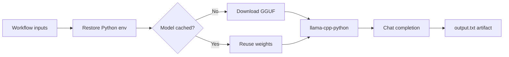

<div align="center">

<sub>Real photography by <a href="https://unsplash.com/photos/a-rack-of-servers-in-a-server-room-2JJ3wBHu4_0">Kevin Ache on Unsplash</a>.</sub>

# AI Inference Runner
### Quantized local LLM inference, dispatched on demand through GitHub Actions.

[](https://github.com/TanishC4444/ai-inference-runner/actions/workflows/inference.yml)


[Architecture](#architecture) · [Models](#model-catalog) · [Run](#run-it) · [Engineering](#engineering-notes)
</div>

---

## Overview

AI Inference Runner turns a manually dispatched GitHub Actions job into a temporary CPU inference worker. A prompt and model configuration enter through workflow inputs; the runner restores its Python and model caches, downloads a quantized GGUF file when necessary, invokes `llama-cpp-python`, and publishes the response as a one-day artifact.

It is the execution repository used by the companion `gh-ai-runner` Python package, but it can also be launched directly from the Actions tab.

## At a glance

| | |
|---|---|
| **Interface** | `workflow_dispatch` inputs for prompt, system message, model, context, temperature, and output length |
| **Compute** | GitHub-hosted Ubuntu runner, four llama.cpp CPU threads |
| **Models** | Six Q4_K_M GGUF instruction/reasoning presets |
| **Caching** | Separate caches for the virtual environment and selected model weights |
| **Output** | Console log plus `output.txt` artifact retained for one day |

## Architecture



## Model catalog

| Key | Model | Default context |
|---|---|---:|
| `tinyllama` | TinyLlama 1.1B Chat | 2,048 |
| `llama` | Llama 3.2 1B Instruct | 4,096 |
| `phi3` | Phi-3.5 Mini Instruct | 4,096 |
| `qwen` | Qwen 2.5 1.5B Instruct | 4,096 |
| `gemma2` | Gemma 2 2B Instruct | 4,096 |
| `deepseek` | DeepSeek-R1 Distill Qwen 1.5B | 4,096 |

All presets use Q4_K_M quantization to fit CPU-based hosted runners. `N_CTX` can override the default, subject to available runner memory.

## Run it

Open **Actions → AI Inference → Run workflow**, then provide:

| Input | Default | Purpose |
|---|---|---|
| `prompt` | required | User message passed to the model |
| `system` | helpful assistant | System behavior |
| `model` | `tinyllama` | Model-map key |
| `cache` | `true` | Restore/save the model cache |
| `max_tokens` | `512` | Maximum generated tokens |
| `temperature` | `0.7` | Sampling randomness |
| `n_ctx` | model default | Optional context override |

For local execution:

```bash
git clone https://github.com/TanishC4444/ai-inference-runner.git
cd ai-inference-runner
python -m venv .venv
source .venv/bin/activate
python -m pip install llama-cpp-python

MODEL=qwen PROMPT="Explain vector databases simply" python run_inference.py
```

## Repository map

```text
ai-inference-runner/
├── .github/workflows/inference.yml   dispatch, caching, artifact upload
├── run_inference.py                  model map, download, inference
└── README.md
```

## Engineering notes

- **Ephemeral by design:** no server runs between requests.
- **Lazy weights:** model files download only on a cache miss.
- **Chat-native invocation:** system and user messages use `create_chat_completion`.
- **Portable output:** downstream callers consume a plain-text artifact.
- **Tradeoff:** cold starts include environment setup and multi-hundred-megabyte or multi-gigabyte downloads; CPU inference is slower than hosted acceleration.
- **Constraint:** model URLs and metadata live in code and must stay synchronized with any external client package.

## Skills demonstrated

GitHub Actions orchestration · local LLM inference · GGUF quantization · cache design · environment-driven configuration · artifact pipelines · CPU/runtime tradeoff analysis

## Resume-ready highlight

> Built a serverless-style inference worker on GitHub Actions that selects among six quantized open models, caches runtime dependencies and weights, executes llama.cpp chat inference, and returns outputs as downloadable artifacts.

## License

No license file is currently included.

